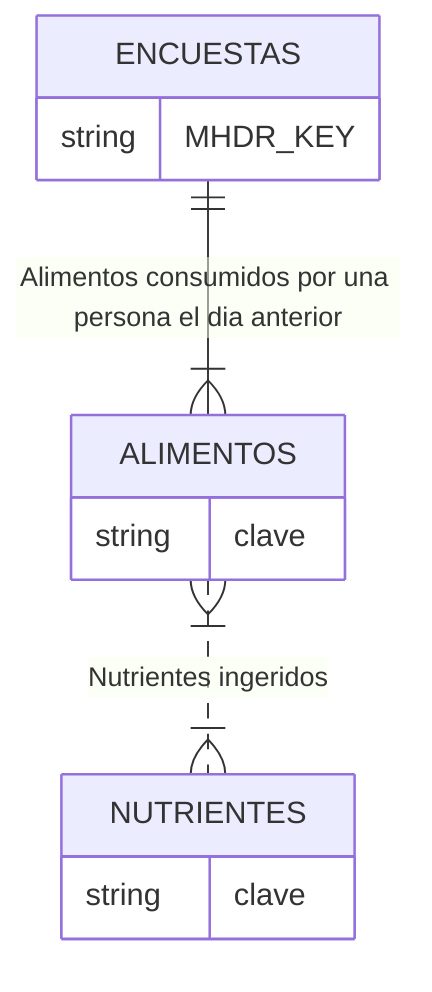

## Base de Datos
### Estructura
La base de datos cuenta con tres tablas. La tabla ENCUESTAS contiene datos de la persona que o para la que se responde la entrevista, la tabla ALIMENTOS contiene los alimentos ingeridos por la persona encuestada uno o más días y la table NUTRIENTES contiene los micronutrientes ingeridos durantes los días relevados para una persona. 

### Variables
|Tabla|Variable|Tipo|Descripcion|
|-----|--------|----|-----------|
|ENCUESTAS|MHDR_KEY|Cadena|Codigo de miembro|
|ENCUESTAS|E_CUEST|Cadena|Cuestionario a aplicar|
|ENCUESTAS|region|Cadena|Región|
|ENCUESTAS|fecha_entr|Fecha|Fecha de la entrevista|
|ENCUESTAS|antropo_fnac|Fecha|Fecha de nacimineto|
|ENCUESTAS|antropo_sex|Cadena|Sexo (para Anthro)|
|ENCUESTAS|Cobertura_salud|Cadena|Cobertura de salud del encuestado|
|ENCUESTAS|PESO|Numérico|Peso|
|ENCUESTAS|TALLA|Numérico|Talla|
|ENCUESTAS|IMC|Numérico|Índice de masa corporal|
|ENCUESTAS|ZPE|Numérico|Z-score de peso para edad|
|ENCUESTAS|ZTE|Numérico|Z-score de talla para edad|
|ENCUESTAS|PTZ|Numérico|Z-score de peso para talla|

## Análisis Paramétrico
### Muestras apareadas

Obesidad: Aquellos niños y niñas con peso superior al 120% del
peso medio correspondiente a un niño o niña de su misma longitud/
estatura, en el caso de la referencia nacional. En el caso de
prevalencia según la referencia de la OMS se utilizó como valor
límite +2 desviaciones estándar[1].