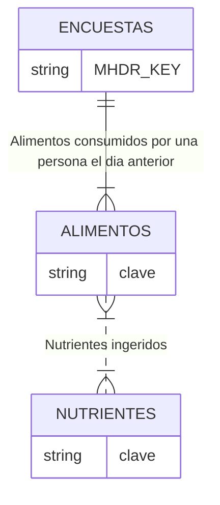

### Estructura de la Base de Datos
La base de datos cuenta con tres tablas. La tabla ENCUESTAS contiene datos de la persona que o para la que se responde la entrevista, la tabla ALIMENTOS contiene los alimentos ingeridos por la persona encuestada uno o más días y la table NUTRIENTES contiene los micronutrientes ingeridos durantes los días relevados para una persona. 
